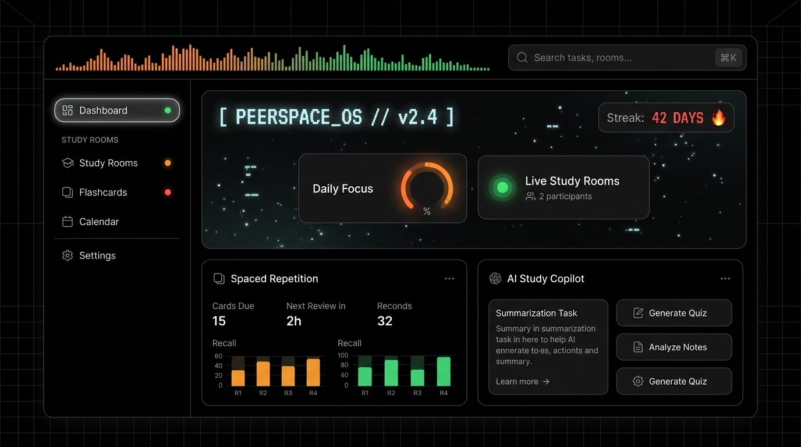
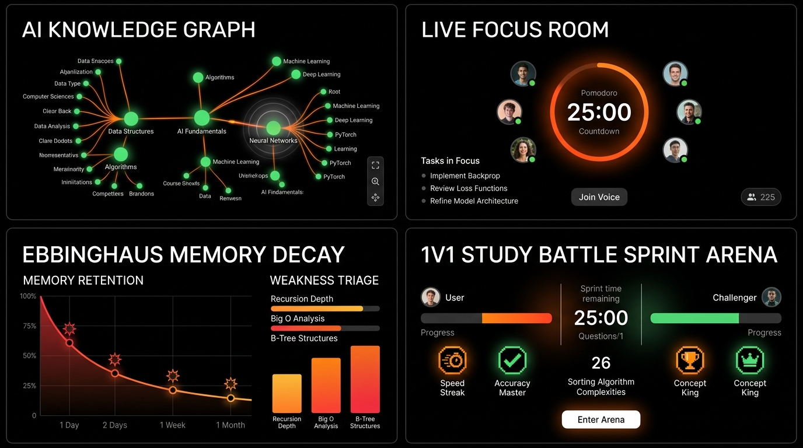

# PeerSpace OS 🚀
### Next-Generation Collaborative Learning & High-Velocity Productivity Platform

<div align="center">



<br/>

[](https://vitejs.dev/)
[](https://react.dev/)
[](https://www.typescriptlang.org/)
[](https://vercel.com/font)
[](LICENSE)

<br/>

**PeerSpace** is a high-velocity collaborative workspace designed for students, engineers, and researchers. It fuses **host-synchronized Pomodoro rooms**, **SuperMemo SM-2 spaced repetition**, **AI knowledge mapping**, and **1v1 study battle arenas** inside a high-contrast monochromatic interface built with strict typographic discipline.

[Explore Features](#-core-capabilities) • [Design System](#-design-system) • [Getting Started](#-getting-started) • [Shortcuts](#-keyboard-shortcuts)

</div>

---

## ⚡ Core Capabilities



### 1. 🌐 Live Focus Rooms & Synchronized Pomodoro
- **Host-Synced Sessions:** Synchronized countdown clocks (25m Deep Work, 5m Short Break, 15m Long Break, 50m Sprints).
- **Real-Time Presence:** Live avatar beacons showing active peers and their current study targets.
- **Synthesized Ambient Audio:** Zero-latency Web Audio soundscapes including Rain, Lo-Fi, Brown Noise, Forest, Campfire, and Vinyl with live visualizer bars.
- **Focus Room Chat:** Distraction-free live room messaging with confetti celebration on completed intervals.

### 2. 🧠 SuperMemo SM-2 Spaced Repetition
- **Cognitive Science Engine:** Implementation of the algorithmic SuperMemo SM-2 interval scheduler.
- **Interval & Ease-Factor Calculation:** Dynamic calculation of retention intervals based on card ratings ($q = 1 \dots 5$).
- **3D Flip Cards:** Interactive deck mastery tracker, due-card triage, and keyboard shortcuts (`Space` to flip, `1-4` to rate).

### 3. 🔬 AI Intelligence Suite
- **AI PDF → Study Notes:** Automatically extracts flashcard decks, high-yield summaries, and predicted exam question sets from syllabus PDFs.
- **AI Knowledge Graph:** Interactive visual concept dependency tree with neural node linkages and prerequisite mapping.
- **Ebbinghaus Weakness & Decay Triage:** Real-time cognitive retention tracker predicting memory decay curves and highlighting at-risk concepts before exams.
- **AI Mock Tests & Timed Hub:** Real-time timed exam evaluations with auto-scoring and subject diagnostic breakdowns.
- **AI Doubt Solver (24/7):** Step-by-step mathematical derivation and code explanation assistant.
- **AI Study Planner:** Automated daily revision roadmaps synced with your exam target dates.

### 4. ⚔️ Study Buddy Matching & 1v1 Battle Arena
- **1v1 Study Sprints:** Match with peer study buddies in live XP races.
- **Streak Protection:** Flame streak tracking with automated Grace Day shielding.
- **Scholar Leaderboard:** Global and university leaderboards ranked by productive focus minutes and verified deck mastery.

### 5. 📚 Resource Hub & Study Kanban
- **Community PDF Library:** Peer-reviewed lecture notes, exam cheat-sheets, and formula cards with upvote ranking.
- **Actionable Study Kanban:** Drag-and-drop workflow tracking with priority tiers (`URGENT`, `MEDIUM`, `LOW`).
- **Command Palette (`⌘K`):** Global instantaneous navigation across decks, focus rooms, notes, and study tools.

---

## 🎨 Design System

PeerSpace uses a high-contrast **Pure Black & White** canvas accented by a strict **Red, Orange, and Green** secondary color palette.

### Typography (Strictly 3 Fonts)
| Font Family | Usage |
| :--- | :--- |
| **Geist Sans** (`font-sans`) | Primary body copy, navigational hierarchy, card headers, and UI controls. |
| **Geist Mono** (`font-mono`) | Timers (MM:SS), telemetry metrics, XP counters, timestamps, and shortcut keys. |
| **Geist Pixel** (`font-pixel`) | Retro-futuristic status tags (`[ PEERSPACE_OS // v2.4 ]`), pixel badges, and hero accents. |

### Color Spectrum
- ⬛ **Canvas Foundation:** Pure Obsidian (`#050505`) in Dark Mode, Pure Crisp White (`#FFFFFF`) in Light Mode.
- 🔴 **Vivid Red (`#EF4444`):** High-priority tasks, streak flames, urgent exam countdowns, and 1v1 arena battles.
- 🟠 **Electric Orange (`#F97316`):** Pomodoro active timers, daily focus velocity dials, and smart action triggers.
- 🟢 **Signal Green (`#22C55E`):** Synchronized peer room indicators, online status beacons, XP mastery progress, and completed goals.
- ▫️ **Geist Pixel Lines:** Dashed retro borders (`.pixel-line`, `.pixel-line-orange`, `.pixel-line-green`) for structural delineation.

---

## 🛠️ Technology Stack

- **Core:** [React 19](https://react.dev/), [TypeScript 6](https://www.typescriptlang.org/)
- **Bundler & Build Tool:** [Vite 8](https://vitejs.dev/) with Hot Module Replacement (HMR)
- **Styling:** [TailwindCSS 3](https://tailwindcss.com/), Custom Vanilla CSS Variables & Glassmorphism
- **Animations:** [Framer Motion](https://www.framer.com/motion/), Custom Micro-Interactions, Canvas Confetti
- **Icons:** [Lucide React](https://lucide.dev/)
- **Audio Engine:** HTML5 Web Audio API Synthesizer
- **Linter & Code Quality:** [Oxlint](https://oxc.rs/)

---

## 🚀 Getting Started

### Prerequisites
- **Node.js**: v18.0.0 or higher
- **npm** or **pnpm** or **yarn**

### Installation

1. **Clone the repository:**
   ```bash
   git clone https://github.com/maheshbanda2005-netizen/peerspace.git
   cd peerspace
   ```

2. **Install dependencies:**
   ```bash
   npm install
   ```

3. **Start the development server:**
   ```bash
   npm run dev
   ```
   Open [http://localhost:5173/](http://localhost:5173/) in your browser.

4. **Build for production:**
   ```bash
   npm run build
   ```

5. **Lint and code audit:**
   ```bash
   npm run lint
   ```

---

## ⌨️ Keyboard Shortcuts

| Shortcut | Action |
| :--- | :--- |
| <kbd>⌘</kbd> + <kbd>K</kbd> / <kbd>Ctrl</kbd> + <kbd>K</kbd> | Toggle Global Command Palette |
| <kbd>Esc</kbd> | Close Modal / Command Palette |
| <kbd>Space</kbd> | Flip Flashcard in Review Session |
| <kbd>1</kbd> / <kbd>2</kbd> / <kbd>3</kbd> / <kbd>4</kbd> | Rate Card Quality (Again, Hard, Good, Easy) |
| <kbd>↑</kbd> / <kbd>↓</kbd> | Navigate Command Palette Results |

---

## 📁 Repository Structure

```text
peerspace/
├── public/
│   ├── images/
│   │   ├── hero_banner.jpg          # Showcase Hero Dashboard
│   │   └── features_preview.jpg     # AI Ecosystem & Features Preview
│   └── favicon.svg
├── src/
│   ├── assets/                      # SVG icons & local branding
│   ├── components/
│   │   ├── AIAssistant.tsx          # 24/7 AI Doubt Solver
│   │   ├── AudioVisualizer.tsx      # Real-time Web Audio Synthesizer Bar
│   │   ├── BentoDashboard.tsx       # Primary OS Grid & Hero Section
│   │   ├── CommandPalette.tsx       # ⌘K Navigation Hub
│   │   ├── ExamMode.tsx             # 10-Year Question Predictor & Exam Papers
│   │   ├── Flashcards.tsx           # SM-2 Spaced Repetition Engine
│   │   ├── FocusRoom.tsx            # Multi-Peer Synchronized Pomodoro
│   │   ├── Header.tsx               # Top Control Bar & Audio Controls
│   │   ├── KanbanBoard.tsx          # Study Tasks Workflow
│   │   ├── KnowledgeGraph.tsx       # Interactive Neural Concept Tree
│   │   ├── Leaderboard.tsx          # Scholar Global Rankings & Streaks
│   │   ├── MockTestHub.tsx          # Timed Diagnostic Evaluations
│   │   ├── PDFStudySystem.tsx       # AI PDF to Flashcards & Roadmaps
│   │   ├── PlacementPrep.tsx        # Technical Interview & DSA Sandbox
│   │   ├── Sidebar.tsx              # Categorized Traffic-Light Navigation
│   │   ├── StudyBuddyMatching.tsx   # 1v1 Battle Arena & Peer Matchmaking
│   │   ├── StudyPlanner.tsx         # Automated Daily Revision Calendars
│   │   └── WeaknessDetector.tsx     # Ebbinghaus Decay & Concept Triage
│   ├── services/
│   │   ├── sm2.ts                   # SuperMemo SM-2 Algorithm Implementation
│   │   ├── soundEngine.ts           # Web Audio Ambient Synth Synthesizer
│   │   ├── storage.ts               # Local Persistence Layer
│   │   └── mockData.ts              # Curated Seed Data & Telemetry
│   ├── types/                       # Core TypeScript Data Interfaces
│   ├── App.tsx                      # Root Application Controller
│   ├── index.css                    # Design Tokens, Pixel Lines & Typography
│   └── main.tsx                     # React Mount Point
├── index.html                       # HTML Entry Point & Google Fonts
├── package.json
├── tailwind.config.js               # Theme Tokens (Red, Orange, Green, Black, White)
├── tsconfig.json
└── vite.config.ts
```

---

## 📄 License

Distributed under the **MIT License**. See `LICENSE` for more information.

---

<div align="center">
  <sub>Engineered with precision for peak academic and technical velocity.</sub>
</div>
